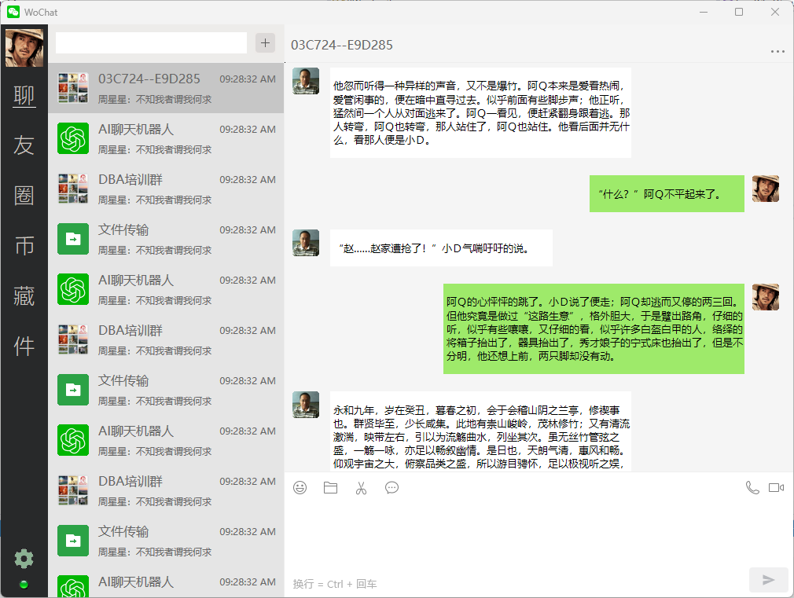

# wochat
The instant messaging(IM) software that is developed using native C/C++

## How To Build It?
Let me explain it in detailed steps. :-) I am to talk about how to build WoChat in Windows 10/11/12 machine.

First of all, you need to setup your environment. You need to install Visual Studio 2022/CMake/Vcpkg. Do not be fear. Their instllation is pretty simple.

